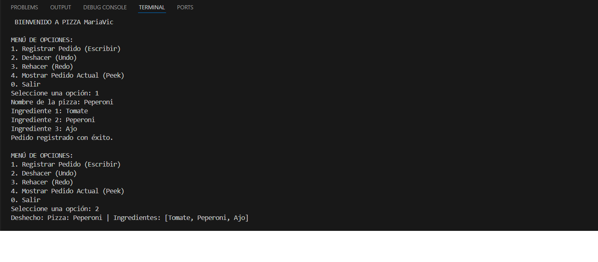
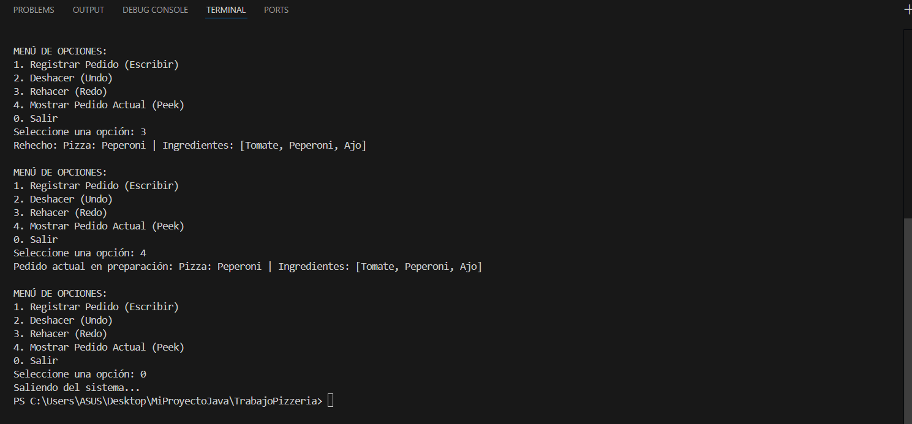

# Pizza-MariaVic: Simulador de Gestión de Pedidos (Undo/Redo)

##  Objetivo
El objetivo de este proyecto es implementar un sistema de gestión de pedidos para una pizzería utilizando la estructura de datos de **Pila (Stack)**. El sistema permite registrar pedidos y ofrece las funcionalidades de "Deshacer" (Undo) y "Rehacer" (Redo) mediante el uso de dos pilas manuales basadas en listas ligadas.


## Fundamentación Teórica

### ¿Qué es una Pila (Stack)?
Una **Pila** es una estructura de datos lineal que sigue el principio **LIFO**, lo que significa que el último elemento en entrar es el primero en salir. 

### Aplicación en Undo/Redo
En este simulador:
1.  **Pila Principal (Undo):** Almacena los pedidos activos. Al hacer "Deshacer", el último pedido se extrae de aquí.
2.  **Pila Secundaria (Redo):** Almacena temporalmente los pedidos eliminados. Si el usuario decide "Rehacer", el pedido vuelve a la Pila Principal.


### Lógica de Punteros en la Lista Ligada
Para cumplir con los requisitos, no se utilizaron librerías externas como `java.util.Stack`. La lógica se basa en **Nodos**:
* **push():** Crea un nuevo nodo, apunta su referencia `siguiente` al actual `tope`, y luego actualiza el `tope` al nuevo nodo.
* **pop():** Captura el valor del `tope`, mueve el puntero del `tope` al nodo `siguiente` y retorna el valor capturado.


##  Tecnologías Utilizadas
* **Lenguaje:** Java 17+
* **IDE:** Visual Studio Code
* **JDK:** Eclipse Temurin
* **Control de Versiones:** Git & GitHub


## Instrucciones de Ejecución
1. Clona el repositorio:
   ```bash
   git clone [https://github.com/LuisaParra25/TrabajoPizzeria.git]

## Captura de pantalla
<details>
  <summary> Haz clic aquí para ver todas las capturas</summary>
  
  
  
</details>

## Autora
- Luisa Fernanda Parra Arboleda

## Link del video 
Link []
